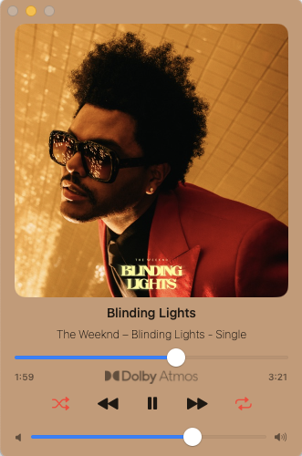

# MiniPlayer for Music 🎵

A lightweight, minimal floating Mini Player for **macOS Music.app**, built with Swift + ScriptingBridge.

> No Electron, No heavy frameworks — just a small native music controller that stays on top.

---

## ✨ Features

- 🎧 Displays **current track, artist, and album art**
- ▶️ Playback controls: play/pause, next, previous
- 🔀 Shuffle & 🔁 Repeat (All / One / Off)
- 🕒 Progress bar with seek support
- 🖼 Smart album art fetching  
  - Primary: AppleScript via Music.app  
  - Fallback: iTunes Search API
- 🔈 **Track Quality Detection**  
  - Bit Depth (16 / 24-bit)  
  - Sample Rate (44.1–192 kHz)  
  - Lossless / Hi-Res Lossless  
  - Dolby Atmos
- 📌 **Always-on-top floating window**
- 🎹 Spacebar to toggle Play/Pause when window is focused
- 🧊 Clean minimal UI
- 🖥 macOS native window with rounded corners & vibrancy

---

## 📸 Preview

### Full Mode

### Compact Mode

---

## ⚠️ Important

This app controls **Music.app via ScriptingBridge**, which **does not work in macOS Sandbox mode**.

> ❌ Will not work as a sandboxed App Store app  
> ✅ Perfect for local use or GitHub distribution

---

## 📦 Installation

1. Download the latest release from **Releases**
2. Move `MiniPlayer.app` to Applications
3. Launch and grant Music.app automation permission

---

## 🚀 Usage

1. Launch MiniPlayer
2. Play a song in the **Music** app
3. Control playback from MiniPlayer window
4. Click window → Press **Space** to toggle play/pause

---

## Dependencies

This project uses the following Swift packages:

- [Sweep](https://github.com/JohnSundell/Sweep) — Simple string scanning utilities
- [SimplyCoreAudio](https://github.com/rnine/SimplyCoreAudio) - A framework that makes CoreAudio easier to use.

---

Built by audex.dev
https://www.audex.dev